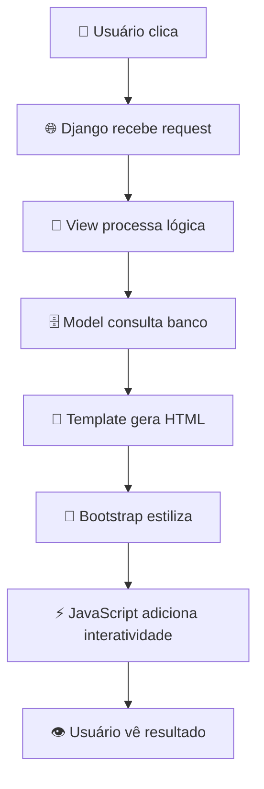
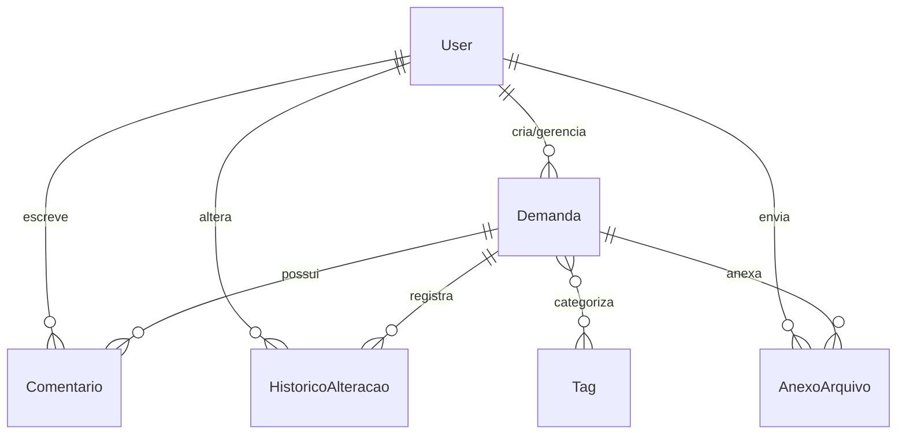

# 🚀 Quasar Cronos - Sistema de Gestão de Demandas

<div align="center">


**Sistema completo para gestão estratégica de demandas organizacionais**

[Instalação](#-instalação) • [Funcionalidades](#-funcionalidades) • [Tecnologias](#-tecnologias) • [Documentação](#-documentação)

</div>

---

## 📋 Visão Geral

**Quasar Cronos** é um sistema web robusto desenvolvido em Django para gestão completa de demandas organizacionais. Projetado para equipes que precisam de **rastreabilidade total**, **priorização inteligente** e **análise estratégica** de suas demandas.

### 🎯 **Público-Alvo**
- **Gestores de Projeto** - Controle total do portfólio
- **Equipes de TI** - Rastreamento de tickets e melhorias
- **Departamentos Corporativos** - Organização de solicitações
- **Analistas** - Relatórios e métricas de performance

### 🏗️ **Stack Tecnológica**
- **Backend:** Django 4.2+ (Python)
- **Banco:** SQLite (desenvolvimento) / PostgreSQL (produção)
- **Frontend:** Bootstrap 5.3 + JavaScript ES6
- **Relatórios:** ReportLab (PDF) + OpenPyXL (Excel)

---

## 🔧 Tecnologias - Explicação Didática

### 🖥️ **Backend (Servidor)**

**Django - O "Cérebro" do Sistema**
```python
# Django = Cozinha de um restaurante
# - Recebe pedidos (requests HTTP)
# - Processa receitas (views + models)  
# - Entrega pratos prontos (HTML renderizado)
```

**Vantagens:**
- ✅ **ORM Integrado:** Trabalha com banco sem SQL manual
- ✅ **Admin Automático:** Interface administrativa pronta
- ✅ **Segurança Built-in:** CSRF, autenticação, validações
- ✅ **Signals:** Eventos automáticos (auditoria sem esforço)

**SQLite/PostgreSQL - O "Arquivo" do Sistema**
```sql
-- SQLite: Arquivo único (.db) 
-- PostgreSQL: Servidor robusto para produção
-- Django ORM traduz Python para SQL automaticamente
```

### 🎨 **Frontend (Interface)**

**Bootstrap - O "Designer Profissional"**
```html
<!-- Bootstrap = Kit de móveis IKEA -->
<!-- Componentes prontos: navbar, cards, botões, formulários -->
<div class="card">          <!-- Card pronto -->
<div class="btn btn-primary"> <!-- Botão profissional -->
<div class="row col-md-6">   <!-- Grid responsivo -->
```

**Por que Bootstrap?**
- ✅ **Visual profissional** em minutos
- ✅ **Responsivo automático** (mobile-first)
- ✅ **Consistência** em todos os navegadores
- ✅ **Menos CSS customizado** para manter

**JavaScript - O "Garçom Interativo"**
```javascript
// JavaScript = Garçom que reage após o prato ser servido
// Django entrega a página, JS adiciona interatividade

// Confirmações inteligentes
if (confirm('Tem certeza que deseja excluir?')) { ... }

// Validações em tempo real  
document.getElementById('campo').addEventListener('input', validar);

// Ajax para dados dinâmicos sem recarregar página
fetch('/api/dados').then(response => response.json());
```

**Por que JavaScript?**
- ✅ **Django é estático** após renderizar
- ✅ **JS reage** a cliques, digitação, eventos
- ✅ **UX moderna** sem recarregamentos constantes

### 🔄 **Fluxo de Integração**



**Analogia Completa:**
- **Django** = Cozinha (processa pedidos)
- **HTML** = Prato (estrutura básica)
- **CSS/Bootstrap** = Decoração (apresentação)
- **JavaScript** = Garçom (interação pós-entrega)
- **SQLite** = Despensa (armazena ingredientes)

---

## ⚡ Funcionalidades

### 🔐 **Autenticação & Segurança**
- ✅ Login moderno com background personalizável
- ✅ Controle de acesso por usuário
- ✅ Sessões seguras com timeout automático
- ✅ Proteção CSRF em todos os formulários

### 📊 **Gestão de Demandas**
- ✅ **Código único automático:** `DEM-2025-001` (rastreabilidade total)
- ✅ **CRUD completo:** Criar, listar, editar, excluir
- ✅ **Status inteligente:** Pendente → Andamento → Concluída
- ✅ **Priorização:** Matriz Eisenhower (Urgente/Importante)
- ✅ **Criticidade:** Baixa, Média, Alta, Crítica
- ✅ **Tags coloridas:** Categorização visual
- ✅ **Anexos ilimitados:** Upload de qualquer arquivo
- ✅ **Histórico automático:** Rastreamento de todas as alterações

### 📈 **Dashboard & Analytics**
- ✅ **Matriz Eisenhower visual:** Quadrantes interativos
- ✅ **Gráficos em tempo real:** Status, prioridades, prazos
- ✅ **Métricas-chave:** Demandas em atraso, concluídas, pendentes
- ✅ **Timeline:** Visualização temporal de entregas

### 🔍 **Busca & Filtros**
- ✅ **Busca global:** Por código, título, solicitante
- ✅ **Filtros avançados:** Status, data, responsável, projeto
- ✅ **Ordenação inteligente:** Por prazo, prioridade, atualização
- ✅ **Paginação otimizada:** Performance em grandes volumes

### 📋 **Relatórios & Exportação**
- ✅ **PDF profissional:** Relatórios formatados com ReportLab
- ✅ **Excel completo:** Todas as colunas exportáveis
- ✅ **Filtros aplicados:** Exporta apenas dados filtrados
- ✅ **Metadados inclusos:** Data geração, usuário, critérios

### 🔔 **Notificações & Validações**
- ✅ **Alertas visuais:** Prazos vencidos, status críticos
- ✅ **Validações automáticas:** Datas, campos obrigatórios
- ✅ **Feedback em tempo real:** Confirmações, erros, sucessos
- ✅ **Auditoria completa:** Quem, quando, o que alterou

---

## 📁 Estrutura de Arquivos

```
📦 gestao_demandas_projeto/
├── 🔧 manage.py                    # Comando principal Django
├── 📄 requirements.txt             # Dependências Python
├── 🗄️ db.sqlite3                   # Banco de dados local
├── 
├── 📁 gestao_demandas/            # ⚙️ Configurações do projeto
│   ├── settings.py                # Configurações principais
│   ├── urls.py                    # Roteamento principal
│   └── wsgi.py                    # Deploy produção
├── 
├── 📁 demandas/                   # 🎯 App principal
│   ├── models.py                  # Estrutura do banco (Demanda, Tag, etc)
│   ├── views.py                   # Lógica de negócio
│   ├── forms.py                   # Formulários e validações
│   ├── admin.py                   # Interface administrativa
│   ├── signals.py                 # Eventos automáticos
│   ├── urls.py                    # Rotas do app
│   └── templates/demandas/        # Templates HTML específicos
├── 
├── 📁 templates/                  # 🎨 Templates HTML base
│   ├── base.html                  # Layout principal
│   └── registration/              # Templates de login
├── 
├── 📁 static/                     # 🎨 Arquivos estáticos
│   └── demandas/
│       ├── css/                   # Estilos customizados
│       ├── images/                # Imagens (backgrounds, etc)
│       └── js/                    # JavaScript customizado
├── 
├── 📁 media/                      # 📎 Uploads de usuários
│   └── anexos/                    # Arquivos anexados às demandas
├── 
├── 📁 docs/                       # 📚 Documentação técnica
│   ├── README.md                  # Este arquivo
│   ├── COMANDOS.md                # Comandos úteis Django
│   └── CHECKLIST.md               # Verificações de deploy
├── 
├── 📁 scripts/                    # 🤖 Automação
│   ├── desenvolvimento/           # Scripts para dev
│   ├── testes/                    # Scripts de diagnóstico
│   └── deploy/                    # Scripts de produção
└── 
└── 📁 tests/                      # 🧪 Testes automatizados
```

---

## 🎯 Decisões Técnicas (Justificativas)

### ⚖️ **Por que Django?**
```python
# Alternativas consideradas:
# ❌ Flask: Muito manual para projeto completo
# ❌ FastAPI: Foco em APIs, não web tradicional  
# ✅ Django: Admin pronto + ORM + Segurança + Comunidade
```

### ⚖️ **Por que SQLite → PostgreSQL?**
```sql
-- SQLite: Desenvolvimento
-- ✅ Zero configuração
-- ✅ Arquivo único portável
-- ❌ Limitado para concorrência

-- PostgreSQL: Produção  
-- ✅ Robusto para múltiplos usuários
-- ✅ Backup/restore profissional
-- ✅ Escalabilidade total
```

### ⚖️ **Por que Código Automático?**
```python
# DEM-2025-001, DEM-2025-002...
# ✅ Rastreabilidade única
# ✅ Ordem cronológica natural
# ✅ Fácil comunicação ("A DEM-2025-015 está pronta")
# ✅ Auditoria e relatórios facilitados
```

### ⚖️ **Por que Signals para Auditoria?**
```python
# Django Signals = Eventos automáticos
@receiver(post_save, sender=Demanda)
def auditoria_automatica(sender, instance, **kwargs):
    # ✅ Nunca esquece de registrar alteração
    # ✅ Consistência total no histórico
    # ✅ Zero intervenção manual
```

### ⚖️ **Por que Upload Ilimitado?**
```python
# Demandas corporativas = Documentos grandes
# ✅ Planilhas complexas, apresentações, manuais
# ✅ Contexto completo para decisões
# ✅ Histórico documental preservado
```

### ⚖️ **Por que Porta 8501?**
```python
# Padrão corporativo
# ✅ Firewall configurado
# ✅ Não conflita com outros sistemas
# ✅ Fácil memorização interna
```

---

## 🚀 Instalação

### 📋 **Pré-requisitos**
- **Python 3.8+** instalado
- **Git** para clonagem do repositório
- **Rede corporativa** com acesso à porta 8501

### 1️⃣ **Clone do Repositório**
```bash
git clone https://github.com/markuscarneiro/app-demandas.git
cd app-demandas/gestao_demandas_projeto
```

### 2️⃣ **Ambiente Virtual**
```bash
# Windows
python -m venv .venv
.venv\\Scripts\\activate

# Linux/Mac
python3 -m venv .venv
source .venv/bin/activate
```

### 3️⃣ **Dependências**
```bash
pip install -r requirements.txt
```

### 4️⃣ **Configuração do Banco**
```bash
# Criar estrutura do banco
python manage.py makemigrations
python manage.py migrate

# Criar usuário administrador
python manage.py createsuperuser
```

### 5️⃣ **Inicialização**
```bash
# Servidor local (desenvolvimento)
python manage.py runserver 127.0.0.1:8501

# Servidor rede (produção local)
python manage.py runserver 0.0.0.0:8501
```

### 6️⃣ **Acesso ao Sistema**
- **URL Principal:** `http://10.1.25.101:8501`
- **Admin Django:** `http://10.1.25.101:8501/admin`
- **Login:** Use credenciais criadas no passo 4

### 🔧 **Scripts Prontos**
```bash
# Desenvolvimento
scripts/desenvolvimento/start_server.bat

# Diagnóstico
scripts/testes/diagnostico.bat

# Status das portas
scripts/testes/PORTAS_STATUS.bat
```

---

## 🛠️ Correções Implementadas

### 🐛 **Problemas Resolvidos**

#### **1. Datas Sumindo nos Formulários**
```python
# ❌ Problema: DateInput padrão não mostrava valores
class DemandaForm(forms.ModelForm):
    data_prazo = forms.DateField(widget=forms.DateInput())

# ✅ Solução: Widget HTML5 com format especificado
class DemandaForm(forms.ModelForm):
    data_prazo = forms.DateField(
        widget=forms.DateInput(attrs={'type': 'date'})
    )
```

#### **2. Status Não Atualizava Automaticamente**
```python
# ❌ Problema: Status manual inconsistente

# ✅ Solução: Lógica automática no save()
def save(self, *args, **kwargs):
    if self.data_conclusao and self.status != 'cancelada':
        self.status = 'concluida'
    elif self.status == 'pendente' and self.tempo_realizado > 0:
        self.status = 'andamento'
    super().save(*args, **kwargs)
```

#### **3. Tempo Realizado Obrigatório**
```python
# ❌ Problema: Permitia salvar sem tempo realizado

# ✅ Solução: Validação customizada
def clean_tempo_realizado(self):
    tempo = self.cleaned_data.get('tempo_realizado')
    if tempo is None or tempo < 0:
        raise ValidationError('Tempo realizado é obrigatório e deve ser ≥ 0')
    return tempo
```

#### **4. Configuração de Rede**
```python
# ❌ Problema: Acesso apenas local

# ✅ Solução: ALLOWED_HOSTS configurado
ALLOWED_HOSTS = [
    '127.0.0.1',
    'localhost', 
    '10.1.25.101',    # IP da rede
    '0.0.0.0',        # Desenvolvimento
]
```

#### **5. Background Login Personalizado**
```css
/* ❌ Problema: Tela de login padrão sem identidade */

/* ✅ Solução: Background customizado + glass morphism */
.login-page-body {
    background-image: url('background-login.jpg');
    background-size: cover;
    background-position: center;
}

.login-card {
    background: rgba(255, 255, 255, 0.95);
    backdrop-filter: blur(10px);
}
```

---

## 🗄️ Estrutura do Banco de Dados

### 📊 **Modelos Principais**

#### **1. Demanda (Tabela Central)**
```python
class Demanda(models.Model):
    # Identificação
    codigo = CharField(unique=True)           # DEM-2025-001
    titulo = CharField(max_length=200)        # Título descritivo
    descricao = TextField()                   # Detalhamento completo
    
    # Pessoas
    solicitante = CharField(max_length=100)   # Quem solicitou
    responsavel = CharField(max_length=100)   # Quem executa
    criado_por = ForeignKey(User)             # Usuário do sistema
    
    # Datas
    data_entrada = DateField(auto_now_add=True)  # Automática
    data_prazo = DateField()                     # Definida pelo usuário
    data_conclusao = DateField(null=True)        # Automática ao concluir
    
    # Classificação
    status = CharField(choices=STATUS_CHOICES)        # Pendente/Andamento/Concluída
    criticidade = CharField(choices=CRITICIDADE_CHOICES)  # Baixa/Média/Alta/Crítica
    prioridade = IntegerField(choices=PRIORIDADE_CHOICES) # 1-5
    
    # Estimativas
    tempo_estimado = DecimalField(max_digits=8, decimal_places=2)
    tempo_realizado = DecimalField(default=0)
    
    # Relacionamentos
    tags = ManyToManyField(Tag)               # Múltiplas tags
    
    # Auditoria
    criado_em = DateTimeField(auto_now_add=True)
    atualizado_em = DateTimeField(auto_now=True)
```

#### **2. Tag (Categorização)**
```python
class Tag(models.Model):
    nome = CharField(max_length=50, unique=True)  # "Urgente", "TI", "RH"
    cor = CharField(max_length=7, default='#6c757d')  # Código hexadecimal
```

#### **3. Comentario (Interações)**
```python
class Comentario(models.Model):
    demanda = ForeignKey(Demanda)             # Qual demanda
    usuario = ForeignKey(User)                # Quem comentou
    texto = TextField()                       # Conteúdo
    criado_em = DateTimeField(auto_now_add=True)
```

#### **4. HistoricoAlteracao (Auditoria)**
```python
class HistoricoAlteracao(models.Model):
    demanda = ForeignKey(Demanda)             # Qual demanda
    usuario = ForeignKey(User)                # Quem alterou
    campo_alterado = CharField(max_length=100)  # Nome do campo
    valor_anterior = TextField()              # Valor antes
    valor_novo = TextField()                  # Valor depois
    data_alteracao = DateTimeField(auto_now_add=True)
```

#### **5. AnexoArquivo (Uploads)**
```python
class AnexoArquivo(models.Model):
    demanda = ForeignKey(Demanda)             # Qual demanda
    arquivo = FileField(upload_to='anexos/')  # Caminho do arquivo
    nome_original = CharField(max_length=255) # Nome do upload
    tamanho = IntegerField()                  # Bytes
    enviado_por = ForeignKey(User)            # Quem enviou
    enviado_em = DateTimeField(auto_now_add=True)
```

### 🔗 **Relacionamentos**



---

## 🆘 Troubleshooting

### ❌ **Problemas Comuns**

#### **1. Erro de Porta em Uso**
```bash
# Problema: "Port 8501 is already in use"
# Solução:
netstat -ano | findstr :8501    # Encontrar processo
taskkill /PID <numero> /F       # Matar processo

# Ou usar porta alternativa:
python manage.py runserver 8502
```

#### **2. Banco de Dados Travado**
```bash
# Problema: "database is locked"
# Solução:
python manage.py shell
>>> from django.db import connection
>>> connection.close()

# Ou reset completo:
del db.sqlite3
python manage.py migrate
```

#### **3. Arquivos Estáticos Não Carregam**
```bash
# Problema: CSS/JS não aparece
# Solução:
python manage.py collectstatic --noinput

# Verificar configuração:
# settings.py
STATIC_URL = '/static/'
STATICFILES_DIRS = [BASE_DIR / 'static']
```

#### **4. Erro de Permissão nos Uploads**
```bash
# Problema: "Permission denied" no diretório media/
# Solução Windows:
icacls media /grant Everyone:F /T

# Solução Linux:
chmod -R 755 media/
chown -R www-data:www-data media/
```

#### **5. Memória Insuficiente**
```bash
# Problema: Sistema lento com muitos anexos
# Solução: Limpeza de arquivos antigos
python manage.py shell
>>> from demandas.models import AnexoArquivo
>>> from datetime import datetime, timedelta
>>> cutoff = datetime.now() - timedelta(days=365)
>>> AnexoArquivo.objects.filter(enviado_em__lt=cutoff).delete()
```

### 📋 **Logs e Diagnóstico**

#### **Verificar Logs do Django**
```python
# settings.py
LOGGING = {
    'version': 1,
    'handlers': {
        'file': {
            'level': 'INFO',
            'class': 'logging.FileHandler',
            'filename': 'django.log',
        },
    },
    'loggers': {
        'django': {
            'handlers': ['file'],
            'level': 'INFO',
            'propagate': True,
        },
    },
}
```

#### **Comando de Diagnóstico**
```bash
# Executar diagnóstico completo
scripts/testes/diagnostico.bat

# Ou manual:
python manage.py check          # Verificar configuração
python manage.py showmigrations # Status das migrações
python manage.py test           # Executar testes
```

### 🔄 **Reset Completo (Último Recurso)**
```bash
# ⚠️ ATENÇÃO: Apaga todos os dados!

# 1. Backup dos dados importantes
python manage.py dumpdata > backup.json

# 2. Reset do banco
del db.sqlite3
python manage.py migrate

# 3. Recriar superuser
python manage.py createsuperuser

# 4. Restaurar dados (se necessário)
python manage.py loaddata backup.json
```

### 💾 **Backup Automático**
```bash
# Script de backup diário
# scripts/backup_daily.bat
@echo off
set DATA=%date:~-4%-%date:~3,2%-%date:~0,2%
python manage.py dumpdata > backup_%DATA%.json
echo Backup criado: backup_%DATA%.json
```

---

## 📚 Documentação Adicional

### 📖 **Arquivos de Referência**
- `docs/COMANDOS.md` - Comandos Django essenciais
- `docs/CHECKLIST.md` - Verificações de deploy
- `docs/POSTGRESQL_CONFIG.md` - Configuração PostgreSQL
- `docs/LOGIN_BACKGROUND_DOCUMENTACAO.md` - Personalização do login

### 🎓 **Para Desenvolvedores**
- `tests/` - Testes automatizados do sistema
- `scripts/desenvolvimento/` - Ferramentas de desenvolvimento
- `docs/IMPLEMENTACAO_*.md` - Guias de implementação específicos

### 🔧 **Para Administradores**
- `scripts/deploy/` - Scripts de produção
- `config/` - Arquivos de configuração
- `docs/PORTAS_ALTERNATIVAS.md` - Configuração de rede

---

## 🏆 Conclusão

O **Quasar Cronos** representa uma solução completa e profissional para gestão de demandas, combinando:

- ✅ **Tecnologia robusta** (Django + Bootstrap)
- ✅ **UX moderna** (Interface intuitiva + responsive)
- ✅ **Auditoria completa** (Rastreabilidade total)
- ✅ **Escalabilidade** (SQLite → PostgreSQL)
- ✅ **Manutenibilidade** (Código organizado + documentado)

### 🚀 **Próximos Passos**
1. **Deploy em produção** com PostgreSQL
2. **Integração com AD** (Active Directory)
3. **API REST** para integrações externas
4. **Notificações por email** automatizadas
5. **Dashboard executivo** com métricas avançadas

---

<div align="center">

**Desenvolvido com ❤️ pela equipe Quasar Cronos**


</div>